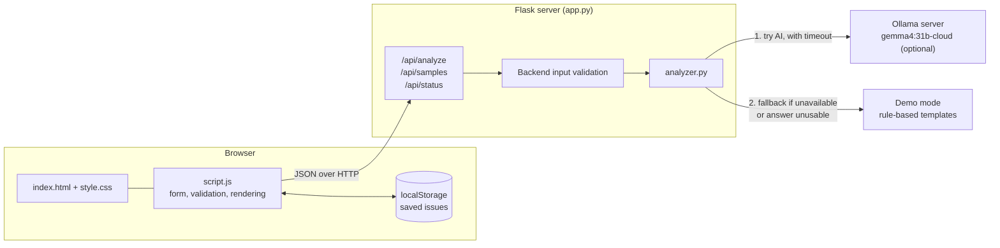
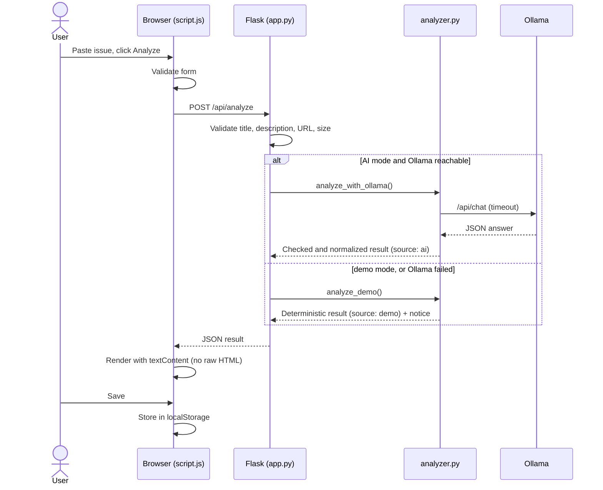
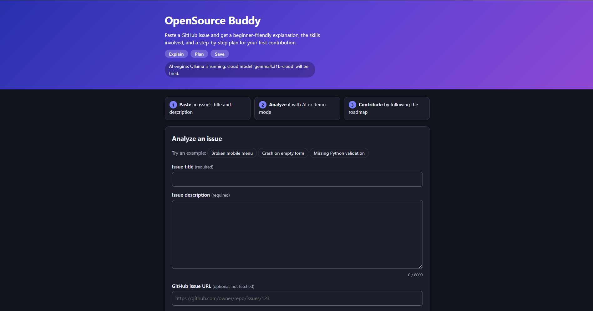
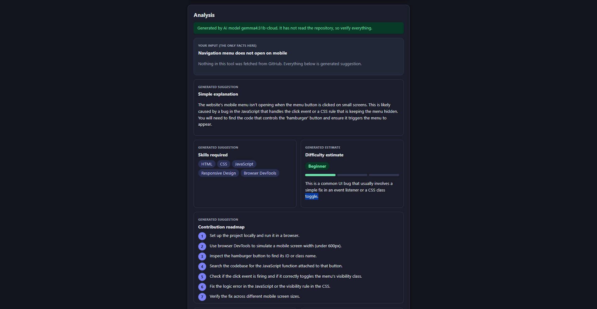

# OpenSource Buddy

**Understand any GitHub issue and plan your first open-source contribution, in under a minute.**

   

## The problem

Many newcomers want to contribute to open source but get stuck at step one: reading an issue and working out what it means, which skills it needs, and where to start. Maintainers tag issues "good first issue", but beginners still don't know *how* to approach them.

OpenSource Buddy turns an issue's title and description into:

1. A plain-language **explanation**
2. The **skills** required
3. A **difficulty estimate** (beginner / intermediate / advanced)
4. A numbered **contribution roadmap**
5. **Questions to investigate** in the repository
6. A **testing checklist** for verifying a fix

> **Honesty by design:** all output is *generated guidance, not verified fact*. The app never reads the repository and never fetches anything from GitHub. The only facts shown are the text you typed, and the UI labels everything else as a generated suggestion.

## Features

- Paste an issue title, description and optional GitHub issue URL (the URL is format-checked only, never fetched).
- Optional AI analysis through a local [Ollama](https://ollama.com) server.
- Deterministic **demo mode** that works with no AI at all, clearly labelled as demo guidance.
- Three built-in sample issues: broken mobile menu, empty-form crash, missing Python validation.
- Save, reopen and delete analyses in your browser (localStorage), tolerant of corrupted data.
- Copy the roadmap as Markdown to paste into a pull request or notes.
- Responsive layout, automatic dark mode, loading state, form validation and friendly errors.
- User text is always rendered as plain text, never as HTML, and the app never executes code from an issue.

## Architecture



### Request flow



### Project structure

```
opensource-buddy/
├── app.py            # Flask routes, input validation, sample issues
├── analyzer.py       # Ollama client, response checking, demo-mode fallback
├── templates/
│   └── index.html    # Single-page UI
├── static/
│   ├── style.css     # Responsive styles + dark mode
│   └── script.js     # Form, rendering, localStorage, copy-to-clipboard
├── requirements.txt  # Flask only
├── LICENSE           # MIT
└── README.md
```

## Technology stack

| Layer | Technology |
|---|---|
| Backend | Python 3, Flask (the only dependency) |
| Frontend | HTML5, CSS3 (custom properties, grid, dark mode), vanilla JavaScript |
| Storage | Browser localStorage |
| Optional AI | Ollama with `gemma4:31b-cloud`, called via Python's standard library (`urllib`) |
| Fallback | Deterministic keyword-based demo templates |
| Docs | Mermaid diagrams |

## Setup (Windows PowerShell)

Requires Python 3.9+ on your PATH.

```powershell
git clone https://github.com/amanrock1/OpenSource-Buddy.git
cd OpenSource-Buddy
python -m venv .venv
.\.venv\Scripts\Activate.ps1
pip install -r requirements.txt
```

If script execution is blocked, run `Set-ExecutionPolicy -Scope Process RemoteSigned` first.

## Run

```powershell
python app.py
```

Open <http://127.0.0.1:5000>. Stop the server with `Ctrl+C`.

## How demo mode works

Demo mode matches keywords in the issue against a few templates (frontend layout, crash on bad input, Python validation) and otherwise uses a generic template. It is deterministic and involves no AI. It is used when:

- you tick **Use demo mode only**, or
- Ollama is unreachable, times out, or returns an unusable answer. The app then shows a notice saying why.

Demo results are labelled "Demo guidance" in the UI, in the banner, and in saved items.

## Optional Ollama integration

By default the app calls `gemma4:31b-cloud` at `http://localhost:11434`. Configure with environment variables before starting:

```powershell
$env:OLLAMA_MODEL = "gemma4:31b-cloud"   # any model you already have in Ollama
$env:OLLAMA_URL = "http://localhost:11434"
$env:OLLAMA_TIMEOUT = "120"              # seconds
python app.py
```

The app does not download models and needs no API keys. Model output is validated and normalized before display, and the issue text is passed to the model as untrusted data.

## Security notes

- Backend validates length, type and URL format and caps request size at 64 KB.
- All user and model text is inserted with `textContent`, never `innerHTML`.
- No credentials in the code or frontend, and `.env` files are git-ignored.
- Code in an issue is never executed.

## Known limitations

- The AI has not seen the repository, so it can be wrong. Difficulty is only an estimate.
- Demo mode is keyword-based and coarse.
- Local models can be slow or return malformed answers (the app then falls back to demo guidance).
- Saved issues live in one browser only, capped at 50.
- No GitHub fetching, login or database by design in this first version.
- Uses Flask's development server, so it is intended for local use.
- No automated test suite yet.

## Screenshots

**Main page**: paste an issue or load an example.



**AI analysis result**: explanation, skills, difficulty estimate and a numbered roadmap, with generated content clearly separated from your input.



## Roadmap ideas

- Fetch issue text from a GitHub URL (read-only)
- Test suite and CI
- More demo templates and languages
- Export saved issues

## Contributing

Contributions are welcome.

1. Fork the repository and create a branch.
2. Make a small, focused change and test it by hand (add tests if you can).
3. Open a pull request describing what and why.

Good first ideas: more demo templates, a pytest suite, accessibility improvements, UI polish.

## License

MIT. See [LICENSE](LICENSE).
